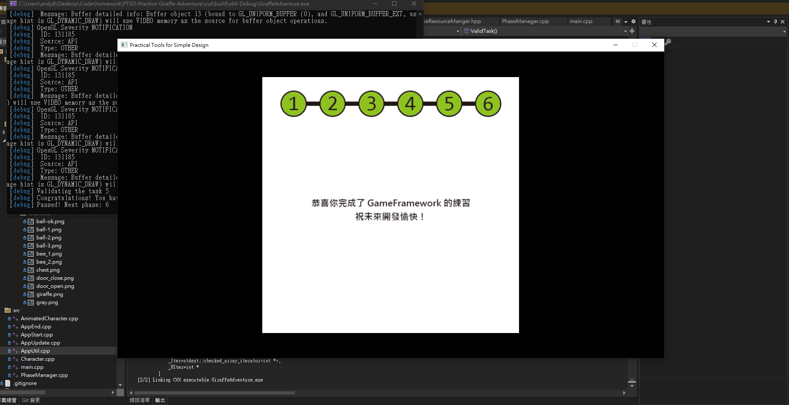

# Abstract

遊戲名稱：馬力歐

組員：

- 113820033 謝奕宏

# Game Introduction

本專案旨在復刻經典 2D 橫捲軸動作遊戲《Super Mario Bros.》。

玩家操控主角 **Mario** 在充滿障礙物與敵人的關卡中奔跑、跳躍，
蒐集金幣與道具，最終抵達關卡終點的旗杆以獲得勝利。

[遊戲畫面連結](https://www.youtube.com/watch?v=rLl9XBg7wSs)

# Development timeline

### 第一階段：基礎建設（Week 1–3）

#### Week 1 — 環境建置與專案架構

- [ ] 建立 GitHub Repository，設定 .gitignore
- [ ] 設定 CMake + FetchContent 自動下載 PTSD v0.2
- [ ] 建立專案目錄結構 (include/ src/ tests/ Resources/)
- [ ] 驗證 PTSD 框架可正常編譯執行
- [ ] 建立 TestFramework.hpp 自製測試框架

#### Week 2 — 核心類別設計

- [ ] 實作 `GameObject` 基底類別 (position, size, active)
- [ ] 實作 `DynamicObject` 可移動物件 (velocity, onGround)
- [ ] 實作 `Vector2D`、`Rectangle` 基礎資料型別
- [ ] 實作 `Constants.hpp` 遊戲常數集中管理
- [ ] 撰寫第一批單元測試（AABB 碰撞偵測）

#### Week 3 — 場景系統與基礎渲染

- [ ] 實作 `GameState` 場景狀態機 (Title / Playing / Paused / GameOver / Victory)
- [ ] 實作 `SceneManager` 場景切換管理
- [ ] 建立 `App.hpp` PTSD 應用框架 (Start / Update / End)
- [ ] 實作標題畫面 (Title Screen)
- [ ] 實作暫停畫面覆蓋 (Pause Overlay)

---

### 第二階段：核心系統（Week 4–7）

#### Week 4 — 角色移動與輸入處理

- [ ] 實作 `Mario` 類別 (moveLeft, moveRight, jump)
- [ ] 實作 `InputHandler` 鍵盤映射 (A/D/Space/ESC/Q/R)
- [ ] 實作 `MarioState.hpp` 狀態枚舉 (PowerState × ActionState)
- [ ] 實作 `SpriteObject` PTSD 渲染橋接
- [ ] 撰寫 Mario 移動單元測試

#### Week 5 — 重力與跳躍系統

- [ ] 實作 `PhysicsEngine` 重力加速度 (980 px/s²)
- [ ] 實作跳躍拋物線 (JUMP_FORCE = 450)
- [ ] 實作最大下落速度限制 (MAX_FALL = 600)
- [ ] 實作地面著地偵測 (setOnGround)
- [ ] 撰寫物理系統單元測試

#### Week 6 — Tile-based 地圖系統

- [ ] 實作 `Tile` 類別階層 (Solid / Breakable / Question / Coin / Pipe / Flag)
- [ ] 實作 `TileFactory::create()` 工廠模式
- [ ] 實作 `Level` 關卡載入器 (.txt → tile grid + enemies)
- [ ] 實作 `GameRenderer` 地圖渲染 (tiles → PTSD sprites)
- [ ] 生成像素風格素材 (16 張 PNG)

#### Week 7 — 碰撞偵測與攝影機

- [ ] 實作 AABB 碰撞偵測 (Rectangle::intersects)
- [ ] 實作碰撞回應系統 (最小重疊方向推回)
- [ ] 處理地面 / 天花板 / 側牆碰撞
- [ ] 實作 `Camera` 跟隨系統 + 邊界鉗制
- [ ] 實作頭頂撞方塊 (Breakable 破壞、Question 彈道具)

---

### 第三階段：敵人與互動（Week 8–10）

#### Week 8 —  期中 Demo (Milestone 1)

- [ ] 展示：角色在完整地圖上移動、跳躍、碰撞
- [ ] 修復座標轉換 (Model ↔ PTSD)
- [ ] HUD 顯示 (SCORE / LIVES / COINS / TIME)
- [ ] 整理程式碼，確認 MVC 分離正確
- [ ] 準備期中 Demo 簡報

#### Week 9 — 敵人 AI (Goomba)

- [ ] 實作 `Enemy` 基底類別
- [ ] 實作 `Goomba` 巡邏 AI（左右來回、碰牆轉向）
- [ ] 實作踩扁判定（從上方碰到 → flatten → 消失）
- [ ] 實作側面碰撞 → Mario 受傷 / 死亡
- [ ] 撰寫 Goomba 碰撞測試

#### Week 10 — 敵人 AI (Koopa) + 龜殼

- [ ] 實作 `Koopa` 巡邏 AI
- [ ] 實作 Koopa 踩變龜殼 (Walk → Shell)
- [ ] 實作龜殼踢出滑行 (Shell → Sliding)
- [ ] 實作龜殼撞死其他敵人 (hitByProjectile)
- [ ] 撰寫 Koopa 龜殼測試

---

### 第四階段：道具與狀態系統（Week 11–13）

#### Week 11 — 道具系統

- [ ] 實作 `Item` 基底類別 (Mushroom, Star)
- [ ] 實作蘑菇：碰到 → Small → Big
- [ ] 實作星星：碰到 → 10 秒無敵
- [ ] 實作金幣收集 (100 coins = 1UP)
- [ ] 實作蘑菇碰牆反向移動

#### Week 12 — Mario 狀態機 + 過關系統

- [ ] 實作 State Pattern (Small → Big → Fire)
- [ ] 實作無敵星星狀態（免傷）
- [ ] 實作死亡彈飛動畫 (velocity.y = -300)
- [ ] 實作旗杆接觸 → 過關 (FlagSlide)
- [ ] 實作關卡切換 (Level 1 → 2 → 3 → Victory)

#### Week 13 — P0 修復 + P1 核心體驗

- [ ] 修復 LIVES 負數 Bug (lives 地板 = 0)
- [ ] 實作受傷後短暫無敵 (2 秒 damageInvincible)
- [ ] 實作可變跳躍高度 (cutJump × 0.45 乘數)
- [ ] 實作奔跑 (LShift → RUN_SPEED)
- [ ] 實作加速 / 減速慣性 (ACCEL / DECEL)
- [ ] 實作 Coyote Time + Jump Buffer
- [ ] 實作踩敵人反彈跳 (STOMP_BOUNCE)
- [ ] 撰寫 P0/P1 新功能測試

---

### 第五階段：內容擴充（Week 14–16）

#### Week 14 — 關卡設計 + 難度遞增

- [ ] 重新設計 Level 1 (80×15, 8 敵人, 3 坑洞, 3 水管)
- [ ] 重新設計 Level 2 (90×15, 10 敵人, 4 坑洞)
- [ ] 重新設計 Level 3 (100×15, 12 敵人, 6 坑洞)
- [ ] 每關加入問號方塊、可破壞磚塊、金幣
- [ ] 每關結尾加入經典階梯 + 旗杆

#### Week 15 — 視覺效果 + 動畫打磨

- [ ] Mario 面向方向翻轉 (scale.x 反轉)
- [ ] 受傷無敵時閃爍效果
- [ ] 走路動畫 (idle → walk1 → walk2 多幀切換)
- [ ] Goomba 壓扁動畫 (flattened sprite)
- [ ] 問號方塊被頂後跳動動畫
- [ ] 金幣彈出動畫
- [ ] 分數浮動文字 ("+100" 上浮消失)

#### Week 16 — 進階功能 + 全面測試

- [ ] 火焰花道具 (大 Mario 頂出 → Fire Mario)
- [ ] 1UP 蘑菇 (碰到 → 生命+1)
- [ ] 道具優先級 (小 Mario → 蘑菇, 大 Mario → 火焰花)
- [ ] 敵人互相碰撞轉向
- [ ] 敵人只在攝影機附近啟動
- [ ] 計時歸零 → 強制死亡
- [ ] 全關卡 Play-through 測試 + 邊界案例修復

---

### 第六階段：打磨與交付（Week 17–18）

#### Week 17 — 🎯 期末 Demo (Final Milestone)

- [ ] 音效整合：跳躍、金幣、敵人、死亡 SFX
- [ ] 背景音樂 (BGM 循環播放)
- [ ] UI 美化：WORLD 1-1 顯示、金幣動畫圖示
- [ ] 完整展示 3 關過關 + OOP 架構 + Design Patterns

#### Week 18 — 報告繳交

- [ ] 撰寫實習報告（架構說明、設計決策、PDCA 心得）
- [ ] 錄製展示影片（3 分鐘遊戲 Demo）
- [ ] 更新 README.md + UML 類別圖
- [ ] 整理程式碼註解 (Doxygen 格式)

# 長頸鹿大冒險通關證明

